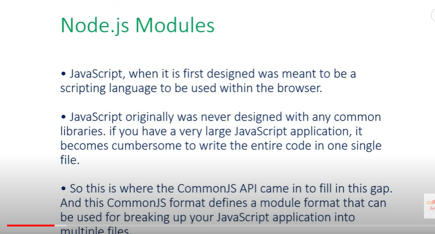
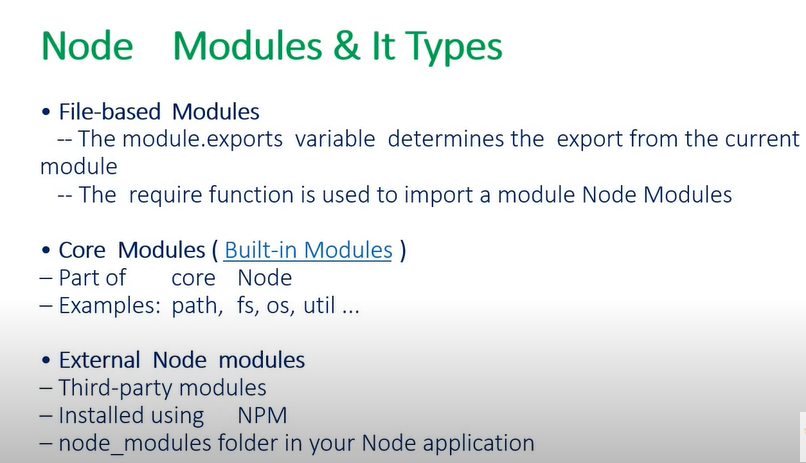

# **[Express.js & Node.js](https://www.youtube.com/watch?v=G8uL0lFFoN0)**

### Node.js

- Created in Chrome in V8 engine.
- Developed in C++

- Contents
    - What & why Node.JS
    - Download & Install Node.JS
    - Hello world on Node.JS
    - Types of Modules.
    - Understanding & use of API
    - Create Simple Server
    

Definition::

Node.JS runs single-threaded, non-blocking, asynchronously programming, which is very efficient.

<div align="center">
  
</div>

> Node REPL
> 
> 
> 
> node. Note: REPL stands for **Read Evaluate Print Loop**, and it is a programming language environment (basically a console window) that takes single expression as user input and returns the result back to the console after execution. The REPL session provides a convenient way to quickly test simple JavaScript code.
> 

<aside>
💡 `npm init`   create package

</aside>

### What is Node Modules & types

JS write the entire code in one single file. So, there are much complex to handle single file. Then Node provides module format that used for breaking up JS into multiple files.

<div align="center">
  
</div>

- **FILE-BASED MODULES**
    
    ### Export command::
    
    ```jsx
    ~~exports.~~ const area = (a) => (a*a); // remove cut line
    
    module.exports.area = area;   
    ```
    
    ### Import command::
    
    ```
    const valueName  = **require** ('./ file navigation.js');
    ```
    
    ```jsx
    console.log(__filename);  // file name
    console.log(__dirname);   // folder name
    ```
    

- **CORE MODULE**
    
    path link:: [https://nodejs.org/api/path.html](https://nodejs.org/api/path.html)
    
    ### Import path command::
    
    ```jsx
    const path  = **require** ('path');
    ```
    
    - Copy File
    
    ```jsx
    const fs = require('fs');
    
    fs.copyFileSync("one.txt","two.txt");
    ```
    
    There are lot of path…..
    
- **EXTERNAL NODE MODULES**
    
    install 3rd party `npm` and others 
    
    link:: [https://www.npmjs.com/package/superheroes](https://www.npmjs.com/package/superheroes)
    

### Design Server from Node JS

```jsx
const http = require('http');

const hostname = "localhost";

const port = 3000;

const server = http.createServer((req, res)=>{
    console.log(req.headers);

    res.statusCode = 200;
    res.setHeader('Content-Type','text/html');
    res.end('<html><body><h1>server connection success::</h1></body></html>');
});

server.listen(port, hostname, ()=> {
    console.log('server running at http://${hostname}:${port}');
});
```

<aside>
💡 Add  dependency in script:::  `"start" : "node index"`

</aside>

### Design Modified Server from Node JS

```jsx
const http = require('http');
const fs = require('fs');
const path = require('path');
const { fileURL } = require('url');

const hostname = "localhost";

const port = 3000;

const server = http.createServer((req, res)=>{
    //console.log(req.headers);

    console.log('request for' +req.url + 'by method ' + req.method);

    if(req.method == 'GET'){
        var fileURL;
        if(req.url == '/'){
            fileURL = "/index.html"
        }
        else{
            fileURL = req.url
        }

        var filePath = path.resolve('./public'+fileURL);

        const fileExt = path.extname(filePath);

        if(fileExt == '.html'){
            fs.exists (filePath, (exists) => {
                if(!exists){
                    res.statusCode = 404;
                    res.setHeader('Content-Type','text/html');
                    res.end('<html><body><h1>Error 404 :'+ fileURL+ 'does not exists</h1></body></html>');

                }

                res.statusCode = 200;
                res.setHeader('Content-Type','text/html');
                fs.createReadStream(filePath).pipe(res); //read data and converts in string show.

            })  //check file is exist or not
        }   else{
                    res.statusCode = 404;
                    res.setHeader('Content-Type','text/html');
                    res.end('<html><body><h1>Error 404 :'+ fileURL+ 'not a html file</h1></body></html>');

        }

    }else{
        res.statusCode = 404;
        res.setHeader('Content-Type','text/html');
        res.end('<html><body><h1>Error 404 :'+ fileURL+ 'Not supported</h1></body></html>');

    }

    
});

server.listen(port,hostname, ()=> {
    console.log('server running at http://${hostname}:${port}');
});
```

<aside>
💡 Create HTML file:: folder:: `public/index.html`

</aside>
